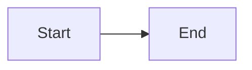

# MDX reference

Snippets that would cost a turn or two to get right from scratch. Copy, adapt, ship.

## Page frontmatter

```yaml
---
title: Page title
description: One-sentence summary. Shown in listings and meta tags.
---
```

## Slide deck

For full-page decks (no page title, no right-hand TOC):

```mdx
---
title: My deck
hide_title: true
hide_table_of_contents: true
---

import { SlideDeck, Slide, SlideTitle } from "@site/src/components/SlideDeck";

<SlideDeck>
  <Slide>
    <SlideTitle>First slide</SlideTitle>
    Content goes here.
  </Slide>
  <Slide>
    <SlideTitle>Second slide</SlideTitle>
    More content.
  </Slide>
</SlideDeck>
```

`<SlideTitle>` renders like `##` but stays out of the right-hand TOC, so the table of contents only reflects real page sections. Decks live under `docs/presentations/`.

## Responsive image with blur placeholder

```mdx
import IdealImage from "@theme/IdealImage";

<IdealImage img={require("@site/static/img/your-image.jpg")} alt="descriptive alt text" />
```

Source must live under `static/`. Works with jpg, png, webp. Plain markdown images (``) already get click-to-zoom without this component.

## Mermaid diagram

````mdx

````

No import, no configuration. Theme auto-detects light and dark.

## Math

```mdx
Inline math reads like $e^{i\pi} + 1 = 0$.

Block math:

$$
\int_{-\infty}^{\infty} e^{-x^2} \, dx = \sqrt{\pi}
$$
```

## Admonition

```mdx
:::tip
A short callout. Types: `note`, `tip`, `info`, `warning`, `danger`.
:::
```
